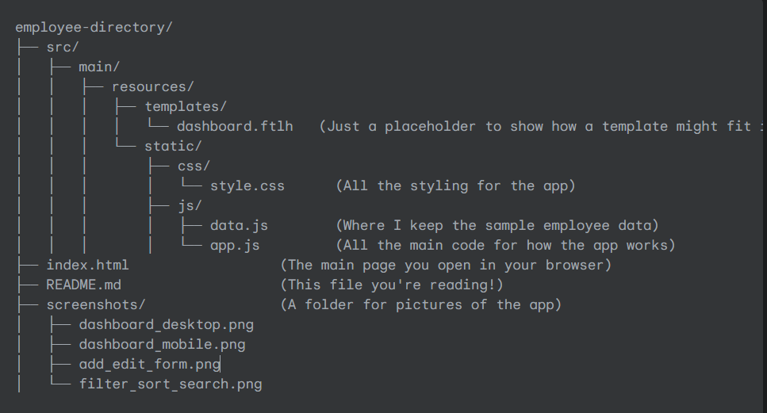

# Employee Directory Web Interface

**Live Demo:** <[https://your-live-demo-link.com](https://ajackus-company-assignment-eta.vercel.app/)> (Please replace this with your actual deployed link)

This is an **Employee Directory Web Interface** that I built to manage employee information. I made it using **HTML, CSS, and plain JavaScript**. It's a responsive and easy-to-use application where you can see, add, change, and remove employee details. I also added features like searching, filtering, sorting, and pagination to make it easier to find and manage employees. All the employee data is stored right in your browser (not on a server), which is great for a quick demo.

## What It Does & How It's Built

I used **HTML** for the page structure, **CSS** for how it looks and to make it work well on different screen sizes, and **vanilla JavaScript** for all the interactive parts. Here are the main things it can do:

* **Show Employees:** Displays all employees in a clean grid layout.
* **Add Employees:** You can add new employees using a form, and it checks if you've filled everything correctly.
* **Edit Employees:** You can easily update an employee's details by clicking "Edit" and changing the info in the form.
* **Delete Employees:** You can remove an employee, and it will ask you to confirm first.
* **Search:** Type in a name or email to quickly find employees.
* **Filter:** Narrow down the list by choosing a department or job role.
* **Sort:** Arrange employees by their first name or department.
* **Pagination:** If there are many employees, it splits them into pages, so you can browse through them easily. You can also choose how many employees to show per page.
* **Works on Any Device:** The design adjusts automatically, so it looks good on desktops, tablets, and phones.
* **Form Checks:** It makes sure you fill in all the necessary fields and that emails are in the right format.

## How the Project is Organized

Here's a look at how the project files are structured. This helps keep everything neat and easy to find:

* `index.html`: This is the main file. Just open it in your browser to start the app.
* `src/main/resources/templates/dashboard.ftlh`: This file is just there to show a common project setup, even though the app runs directly from `index.html`.
* `src/main/resources/static/css/style.css`: This file contains all the visual styles and rules that make the app look good and work on different screen sizes.
* `src/main/resources/static/js/data.js`: This file holds the sample employee information that the app uses.
* `src/main/resources/static/js/app.js`: This is the heart of the app's logic. It contains all the JavaScript code that makes everything interactive, like adding, editing, deleting, searching, and sorting.

## How to Run It

It's super simple! You don't need to install anything special like a server.

1.  **Get the Files:**
    * Make sure you have all the project files in a single folder on your computer (e.g., `employee-directory-project`). The folder structure should match what's shown above.
2.  **Open in Your Browser:**
    * Go to your `employee-directory-project` folder.
    * Find the `index.html` file.
    * **Double-click** on `index.html`.

That's it! Your web browser will open the Employee Directory, and you can start playing around with it.

## Screenshots

I've included some screenshots in the `screenshots/` folder to show how the app looks and works on different devices:

* `dashboard_desktop.png`: What the main employee list looks like on a computer screen.
* `dashboard_mobile.png`: How the app adjusts to look good on a phone screen.
* `add_edit_form.png`: A picture of the form you use to add or edit employees.
* `filter_sort_search.png`: An example of the search, filter, or sort features in action.

## My Thoughts on Building This

### What Was Tricky:

1.  **Making it Feel Like a Real App:** Even though it doesn't have a full server, I wanted to set up the project files in a way that looks like a typical web application. This involved making `index.html` handle everything on the user's side.
2.  **Getting Search, Filter, and Sort to Play Nice:** Making sure that when you search, then filter, then sort, everything works correctly and shows the right results was a bit of a puzzle. I made sure they all work together smoothly.
3.  **Keeping the Screen Smooth:** Every time you add, edit, delete, or change a filter, the list needs to update. I focused on making sure these updates happen quickly and smoothly without any hiccups.
4.  **Forms on Different Screens:** Designing the add/edit form to pop up nicely and look good on both big computer screens and small phone screens took some careful planning with CSS and JavaScript.

### What I'd Do Next (If I Had More Time):

1.  **Save Data Permanently:** Right now, if you close the browser, your changes are gone. I'd add a way to save the employee data using your browser's local storage so it stays even after you close the tab.
2.  **Better Accessibility:** I'd improve it for people who use screen readers or keyboards to navigate, making sure everyone can use the app easily.
3.  **Small Animations:** Adding subtle animations when forms appear or when you filter the list could make the app feel even more polished.
4.  **More Filter Options:** I'd expand the filtering so you could select multiple departments or roles at once, or even filter by things like salary ranges if that data were available.
5.  **Organize JavaScript More:** For a bigger project, I'd break down the `app.js` file into smaller, more specialized parts to keep the code even cleaner and easier to manage.
